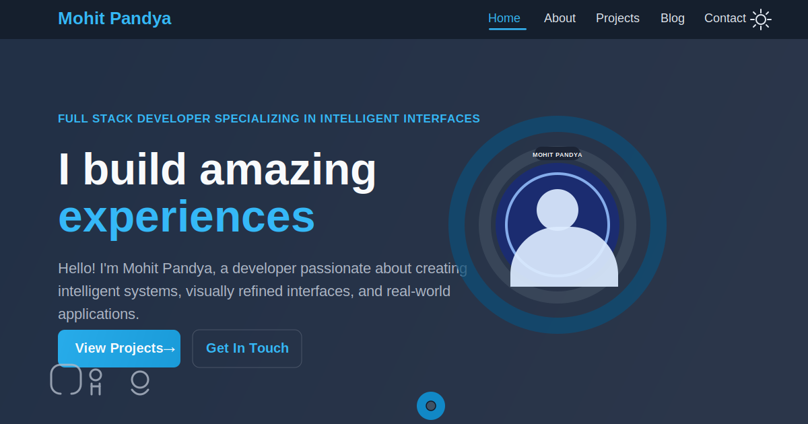

# Mohit Pandya Portfolio

[](https://github.com/Spixet/Portfolio-website/actions/workflows/ci.yml)

Personal portfolio website built with Next.js, TypeScript, Tailwind CSS, Framer Motion, and React Three Fiber.



## Live Demo

- Production: `https://portfolioo-five-drab.vercel.app`

## Highlights

- Responsive multi-page portfolio built with the App Router
- Animated UI with Framer Motion and a custom Three.js background
- About, Projects, Blog, and Contact pages
- Secure server-side contact form with SMTP support
- SEO metadata, sitemap, robots, and social preview images
- Dark mode support with persistent theme initialization

## Technical Highlights

### Interactive 3D Background

- Custom Three.js background built with React Three Fiber and Drei
- Layered nebula, particles, stars, and orbiting energy effects instead of a static hero image
- Client-only mounting for the 3D scene to avoid App Router hydration issues

Why it matters: it shows front-end depth beyond standard component libraries and demonstrates comfort with graphics-heavy UI work.

### Server-Side Contact Form

- Contact form posts to a server-side API route instead of using a third-party embed
- SMTP delivery handled with Nodemailer on Vercel
- Includes input validation, sanitization, origin checks, honeypot/timing checks, and rate limiting

Why it matters: it shows full-stack thinking and production-minded handling of real user input.

### Production Readiness

- SEO metadata, sitemap, robots, and social preview images are configured for sharing and indexing
- Theme preference is persisted and initialized before hydration to avoid flash-of-incorrect-theme issues
- GitHub Actions runs lint, build, and type checks on pushes and pull requests

Why it matters: it reflects attention to polish, reliability, and the details that affect real users after launch.

## Tech Stack

- Next.js 15
- React 19
- TypeScript
- Tailwind CSS
- Framer Motion
- Three.js / React Three Fiber / Drei
- Nodemailer
- Vercel

## Project Structure

```text
app/
  about/                About page
  api/contact/          Contact form API route
  blog/                 Blog page
  components/           Reusable UI and background components
  contact/              Contact page
  context/              Theme context
  lib/                  Shared site configuration
  projects/             Projects page
public/
  images/               Icons, placeholders, and profile assets
  og-image.svg          Open Graph preview image
  twitter-image.svg     Twitter/X preview image
  resume.pdf            Public resume asset
  theme-init.js         Theme bootstrapping script
```

## Why I Built It This Way

- I load the Three.js background through a dynamic client-only boundary so the visual layer stays rich without fighting server rendering.
- I initialize the theme before React hydration so dark mode feels intentional instead of flashing on first load.
- I kept site-wide identity and contact metadata in a shared config file to make future content updates less error-prone.
- I used a server-side contact route because I wanted the project to demonstrate real backend concerns, not just front-end presentation.

## Key Learnings

- Rich 3D backgrounds are much more stable when they are isolated from SSR and treated as a client-only enhancement.
- Small serverless endpoints still need the same basics as larger backends: validation, abuse protection, and clear fallbacks.
- Portfolio projects become stronger when they communicate engineering decisions, not just the final UI.

## Local Development

Install dependencies:

```bash
npm install
```

Start the development server:

```bash
npm run dev
```

Run the production build:

```bash
npm run build
```

## Environment Variables

Create a local env file from `.env.example`.

The contact route supports these variables:

- `SMTP_HOST`
- `SMTP_PORT`
- `SMTP_SECURE`
- `SMTP_USER`
- `SMTP_PASS`
- `CONTACT_TO_EMAIL`
- `CONTACT_FROM_EMAIL`

## Deployment

This project is configured for Vercel.

Preview deployment:

```bash
npx vercel
```

Production deployment:

```bash
npx vercel --prod
```

## Automated Checks

GitHub Actions runs the following on pushes and pull requests to `main`:

- `npm ci`
- `npm run lint`
- `npm run build`
- `npx tsc --noEmit`

## Repository Notes

- Source code, public assets, and project config are committed
- Generated and local-only files such as `node_modules/`, `.next/`, `.vercel/`, and real `.env` files are ignored
- No real SMTP secrets are stored in this repository; `.env.example` is a safe template only

## Status

This project is live in production and configured for Vercel-based hosting.
